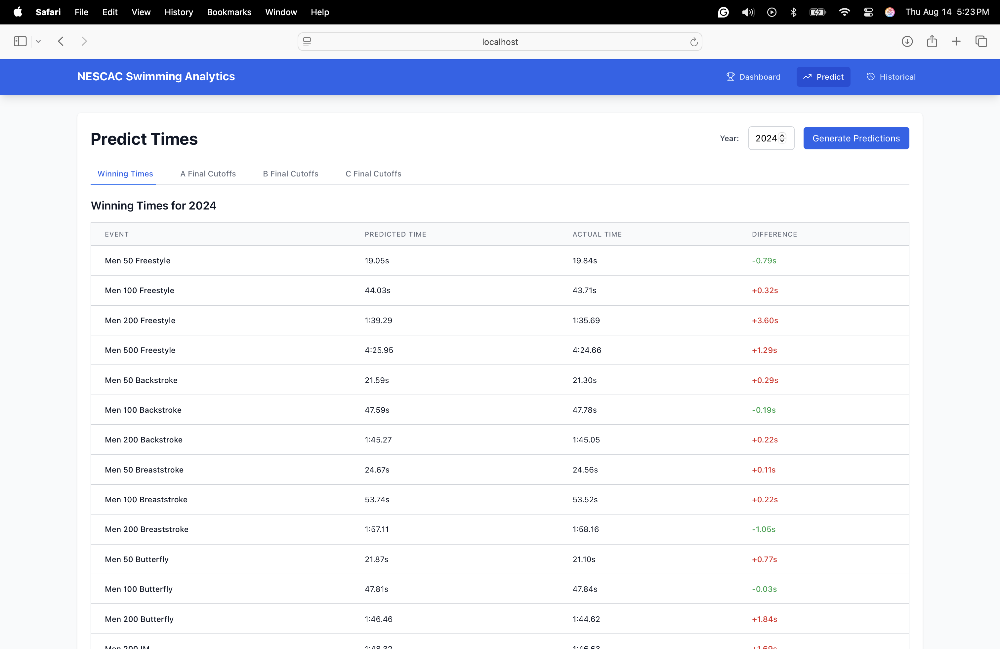
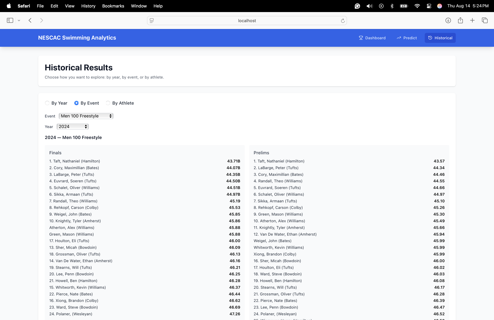
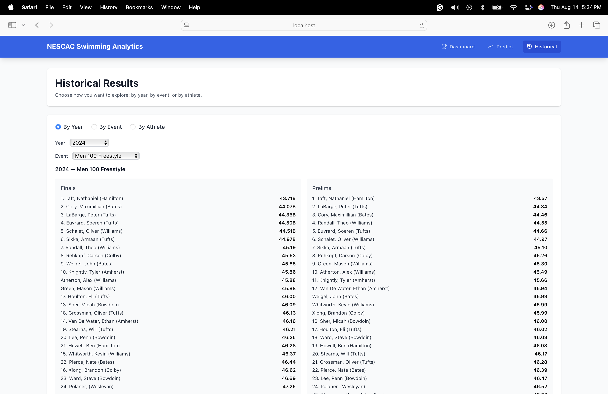

# NESCAC Swimming Analytics Platform

A comprehensive web application for analyzing and predicting swimming performance in the New England Small College Athletic Conference (NESCAC). This platform combines machine learning models, interactive visualizations, and a complete data pipeline to help coaches and swimmers make informed decisions about event selection and performance expectations.

## Project Overview

The NESCAC Swimming Analytics Platform provides:
- **Predictive Models**: Machine learning models that predict finals qualification for all NESCAC events
- **Interactive Dashboard**: React-based frontend with historical data analysis and prediction interface
- **Data Pipeline**: Automated PDF parsing with manual correction workflows for data quality
- **Comprehensive Visualizations**: School-specific analysis, event cutoffs, and winning time trends
- **API Backend**: Flask server providing model predictions and data endpoints

## Architecture

### Frontend (`app/frontend/`)
- **React.js** application with modern UI components
- Interactive dashboards for historical data and predictions
- Real-time model predictions with user-friendly interface
- Responsive design for desktop and mobile use

### Backend (`app/backend/`)
- **Flask API** serving machine learning models
- RESTful endpoints for data retrieval and predictions
- Model serving infrastructure for both simple and advanced models
- Database integration for efficient data storage and retrieval

### Data Pipeline (`src/`)
- **PDF Parser**: Automated extraction from NESCAC meet results
- **Manual Correction**: Workflow for data quality assurance
- **Feature Engineering**: Advanced feature creation for model training
- **Data Validation**: Quality checks and consistency validation

### Models (`output/models/`)
- **Simple Models**: Baseline predictions using basic features
- **Advanced Models**: Enhanced predictions with sophisticated feature engineering
- **Model Evaluation**: Comprehensive performance metrics and validation

## Key Features

### 1. Finals Qualification Prediction
Predict whether a swimmer will qualify for A, B, or C finals based on their seed time and historical data.

### 2. Event Selection Optimization
Help swimmers choose between conflicting events by predicting scoring potential and qualification likelihood.

### 3. Historical Analysis
Comprehensive analysis of past NESCAC championships with trends and patterns.

### 4. School-Specific Insights
Detailed analysis of each NESCAC school's performance across events and years.

## Usage Examples

### Case Study: Event Selection Decision

**Scenario**: A mid-distance swimmer who swims fly and freestyle needs to choose between the 100 fly and 200 free, which are on the same day at NESCACs. The goal is to maximize points earned.

**Personal Bests**:
- 200 Free: 1:44.13 (PB), 1:45.61 (Season Best)
- 100 Fly: 49.81 (PB), 51.01 (Season Best)

**Model Predictions**:
- **200 Free**: Predicted to miss C final with both PB and season best
- **100 Fly**: Predicted to make B final with PB, C final with season best

**Decision**: Choose 100 Fly for higher scoring potential.

### Dashboard Usage

The platform provides an intuitive interface for:
- Viewing predicted qualification levels
- Comparing scoring potential across events
- Analyzing historical trends



### Historical Data Analysis

Comprehensive visualizations showing:
- Results by event over time
- School performance comparisons
- Cutoff time trends
- Winning time analysis




## Technical Implementation

### Data Processing Pipeline

1. **PDF Parsing**: Automated extraction from meet result PDFs
2. **Manual Correction**: Human review and correction of parsed data
3. **Feature Engineering**: Creation of predictive features
4. **Model Training**: Training of simple and advanced models
5. **Validation**: Cross-validation and performance evaluation

### Model Architecture

- **Simple Model**: Linear regression with basic features
- **Advanced Model**: Ensemble methods with sophisticated feature engineering
- **Feature Set**: Includes seed time, historical performance, event-specific factors
- **Validation**: Time-series cross-validation to prevent data leakage

### Data Quality Assurance

Due to the irregularity of recorded data across formats, the platform includes:
- Manual correction workflows for data accuracy
- Multiple parsing techniques for different PDF formats
- Quality validation checks
- Comprehensive error handling

## Performance Metrics

The models achieve strong predictive performance:
- High accuracy in finals qualification prediction
- Reliable scoring potential estimates
- Robust performance across different events and years
- Consistent results for both men's and women's events

## Getting Started

### Prerequisites
- Python 3.8+
- Node.js 14+
- Required Python packages (see requirements.txt)

### Installation

1. **Clone the repository**
   ```bash
   git clone <repository-url>
   cd nescac
   ```

2. **Set up the backend**
   ```bash
   cd app/backend
   pip install -r requirements.txt
   python app.py
   ```

3. **Set up the frontend**
   ```bash
   cd app/frontend
   npm install
   npm start
   ```

## Project Structure

```
nescac/
├── app/
│   ├── backend/          # Flask API server
│   └── frontend/         # React application
├── data/
│   ├── processed/        # Cleaned and processed data
│   └── school-specific/  # School-specific datasets
├── output/
│   ├── models/           # Trained machine learning models
│   ├── plots/            # Generated visualizations
│   └── prediction/       # Model predictions
├── src/
│   ├── nescac_src/       # Core Python modules
│   └── logs/             # Application logs
└── docs/                 # Documentation and images
```

## Future Work

- Database integration for real-time data updates
- Mobile application development
- Integration with swimming meet management systems
- Advanced analytics for training optimization


